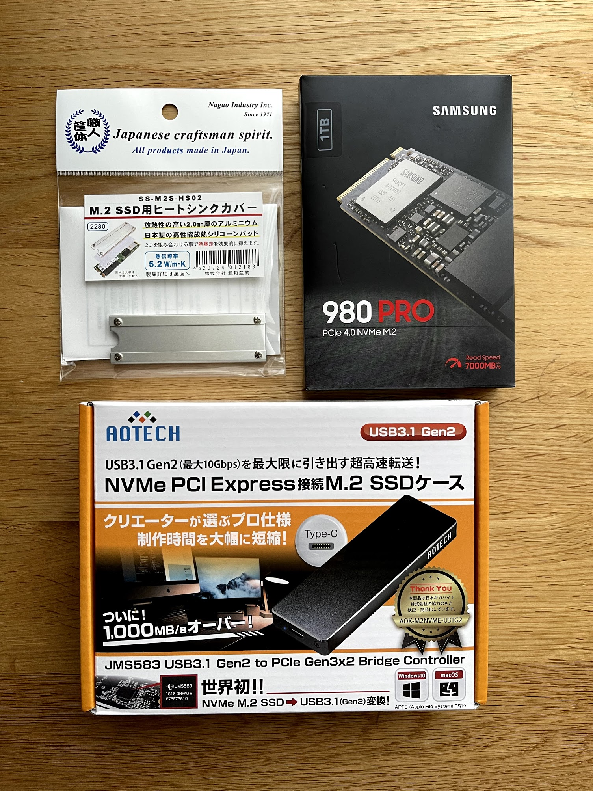
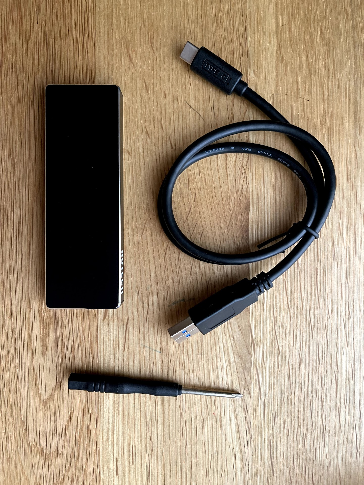
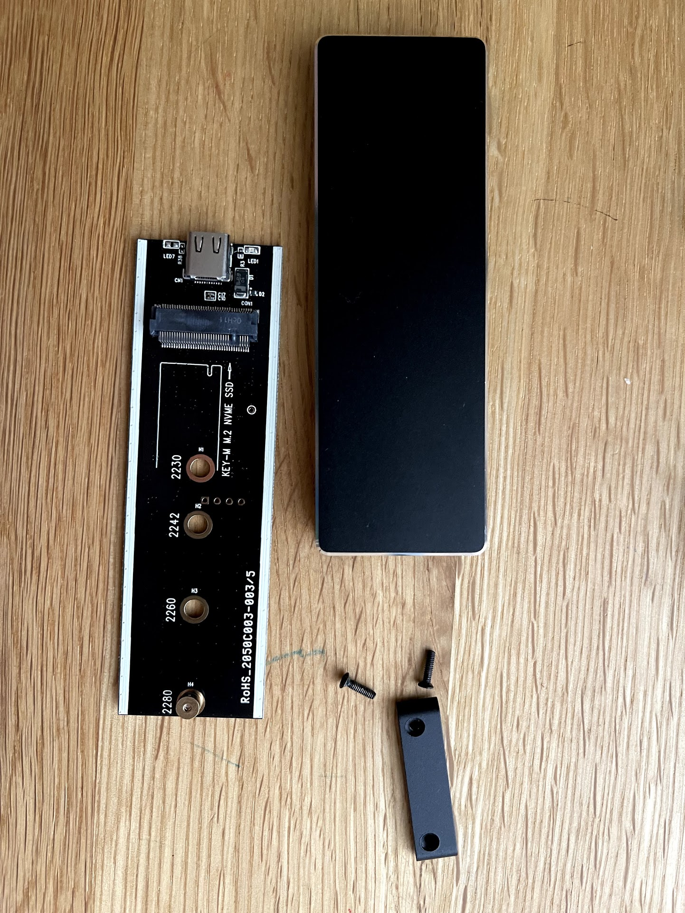
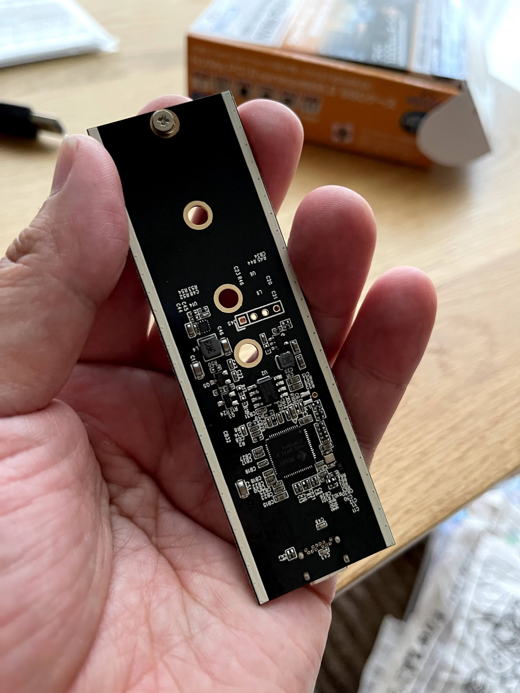
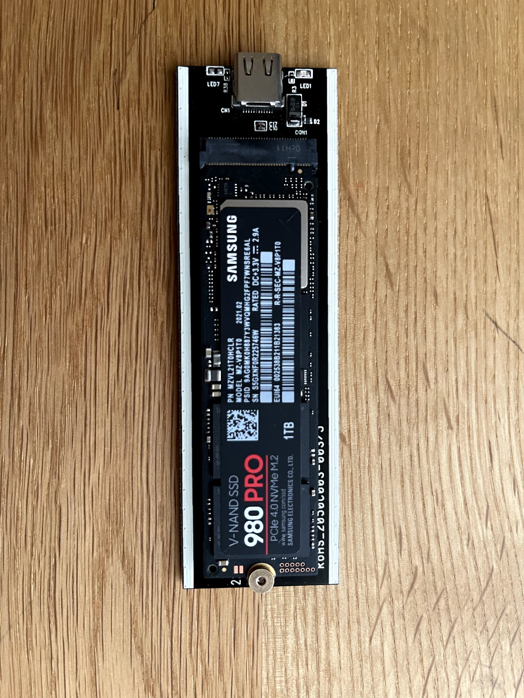
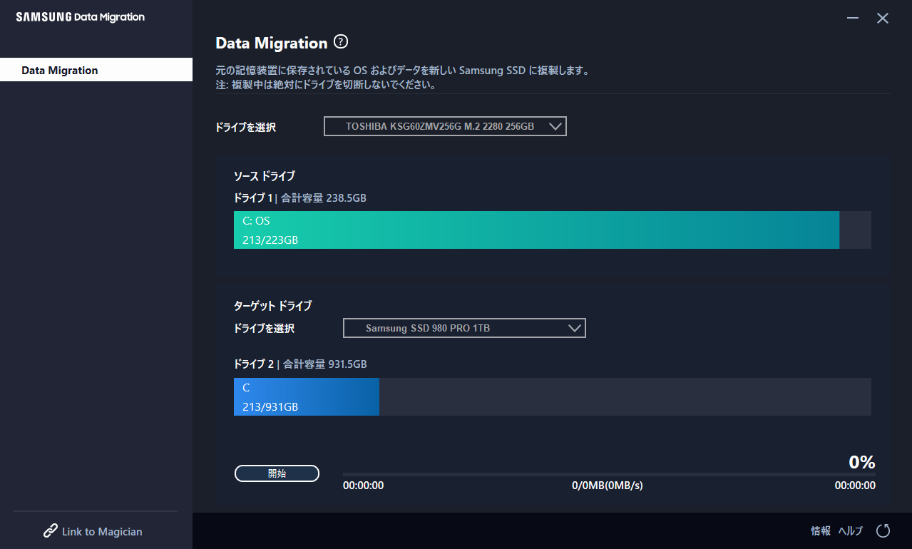
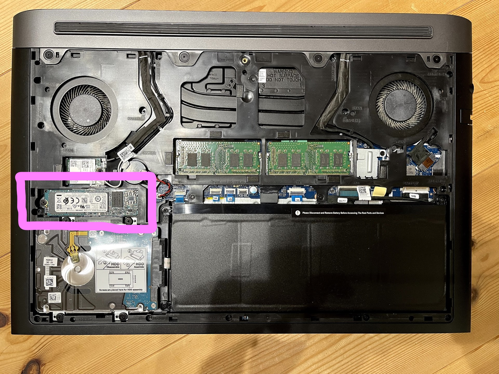
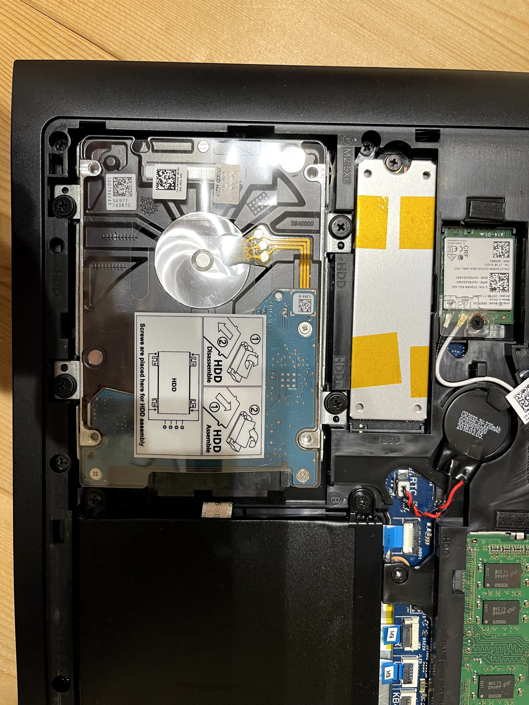
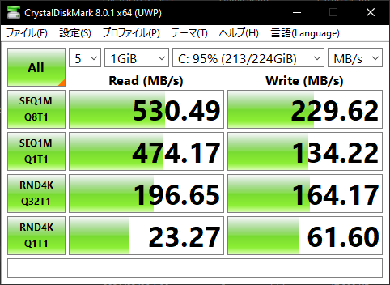
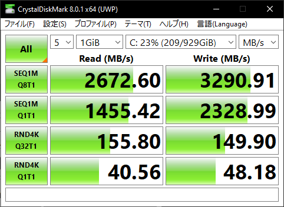

Windows10ノートPC(Dell G5 5587)のSSDをSamsung SSD 980 Pro(1TB)に換装したときのメモ 
======

# はじめに

私物のWindows10ノートPC(Dell G5 5587)のSSD容量不足解消のために換装しました．
そのときのメモを残しておきます．

# 今回買ったもの

下記のものを買いました．執筆当時(2021.5)のお値段はyodobashiで￥34,910 でした．
ヒートシンクは念の為．もしかしたら要らなかったかも．

|  種別  |  品名  | amazon | yodobashi |
| :-: | :-: | :-: | :-: |
|   NVMe M.2 SSD  |  Samsung SSD 980 Pro 1TB | [link](https://www.amazon.co.jp/dp/B08JCPTPMM/) | [link](https://www.yodobashi.com/product/100000001005831015/) |
|  NVMe M.2 SSD対応外付けUSBケース | AOTECH AOK-M2NVME-U31G2 | [link](https://www.amazon.co.jp/dp/B07J1MTP11)  | [link](https://www.yodobashi.com/product/100000001004066879/) |
| ヒートシンク | 長尾製作所 SS-M2S-HS02 | [link](https://www.amazon.co.jp/dp/B06XJXWJVZ/) | [link](https://www.yodobashi.com/product/100000001003487154/) |

# ざっくり手順

1. SSDをUSBケースに入れる
2. Samsung Data Migration SoftwareでCドライブを丸っとバックアップする
3. SSDを換装する

## 1. SSDをUSBケースに入れる

まずはSSDをUSBケースに入れます．

## 2. Samsung Data Migration SoftwareでCドライブを丸っとコピーする

Samsung Data Migration Software というツールを[こちら](https://www.samsung.com/semiconductor/minisite/jp/support/tools/)からダウンロード＆インストールしてCドライブを丸ごとコピーしました．

## 3. SSDを換装する

置き換え前はこんな感じ

ヒートシンクつけて置き換え

# ベンチマーク

[CrystalDiskMark](https://www.microsoft.com/ja-jp/p/crystaldiskmark/9nblggh4z6f2?activetab=pivot:overviewtab)でベンチマークしました．
いい感じで高速になりました．

## before

## after

# 参考にしたページ

* 【PC】DELL Gシリーズ 5587のCドライブのM.2 TypeのSSDの交換

    https://kimono-oyaji.com/dell-g5-ssd-chinge-01/

* M.2 SSD換装がより手軽に、外付けケース経由でのOS移行にも対応したSamsungのツールを試す

    https://akiba-pc.watch.impress.co.jp/docs/sp/1267258.html
